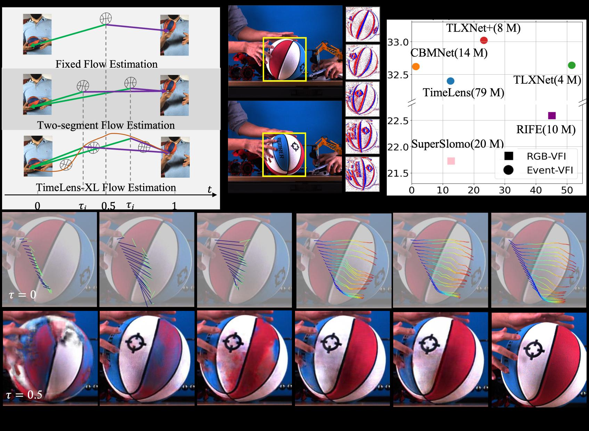

# TimeLens-XL: Real-time Event-based Video Frame Interpolation with Large Motion




[[Project Page](https://openimaginglab.github.io/TimeLens-XL/)] [[Paper Link]()] [[Dataset]()]

This is the codebase for our paper TimeLens-XL, which has been accepted by ECCV2024. In this paper, we propose a lightweight netowrk for Event-VFI which is able to interpoalte for large motions in realtime at 720p resolution. We provide pretrained weights, code for evaluation for both our TLXNet, TLXNet+, and state-of-the-art methods.

Please email Mr. Yongrui Ma (yongrayma@gmail.com) for questions related to this work.

## Update History
Finished:
* Refresh readme file to fix some existing bugs

Coming soon:

* Will release all experimental results and corresponding weights by the end of January;
* Will release generated synthetic datasets by the beginning of February 2025.

## Quick Start
### Environment
Please download dependency packages by
```bash
pip install -r requirements.txt
```

### Dataset
Download supported datasets and change path files in `params/Paths` accordingly. Currently we support:
1. Adobe dataset;
2. GOPRO dataset;
3. [BSERGB dataset](https://github.com/uzh-rpg/timelens-pp/?tab=readme-ov-file);
4. HQEVFI dataset [[Google Drive]](https://drive.google.com/file/d/104ZMJ-M_frImOOCGfLk_HDb2FV1trveT/view?usp=drive_link);

Please notice that 1 and 2 are synthetic datasets. We first interpolate Adobe and GOPRO dataset to 1920 FPS (x8) with [RIFE](https://github.com/hzwer/ECCV2022-RIFE), and then synthesis events based on [v2e](https://github.com/SensorsINI/v2e).

Compared with original v2e, we made several changes on the simulator:
1. We remove image resize to make the RGB and event stream the same size, as we do not focus only on davis camera with fixed resolution;
2. We removed the random disturbance on time as we already have temporal dense RGB frames.

Please re-generate the synthetic dataset according to v2e simulator or we will release our simulator and synthetic datasets shortly.

### Pretrained weights
on HQ-EVFI dataset:
[TLXNet+](https://drive.google.com/file/d/1t0Zd3fNLDSsrsZOy8XNA82-wOhv7Wd7t/view?usp=sharing)

on BSERGB dataset: [TLXNet+ x4 interpolation](https://drive.google.com/file/d/19yaIKsDNpKiDSMA8XARSIovLXvnCEchB/view?usp=sharing)

### Evaluation on HQ-EVFI
python run_network.py --param_name traintest_RC_smallmix_lpips --model_name Expv8_large --model_pretrained ./weights/Expv8_large_HQEVFI.pt --skip_training

### Training on HQ-EVFI
Just remove --skip_training of evaluation code. 